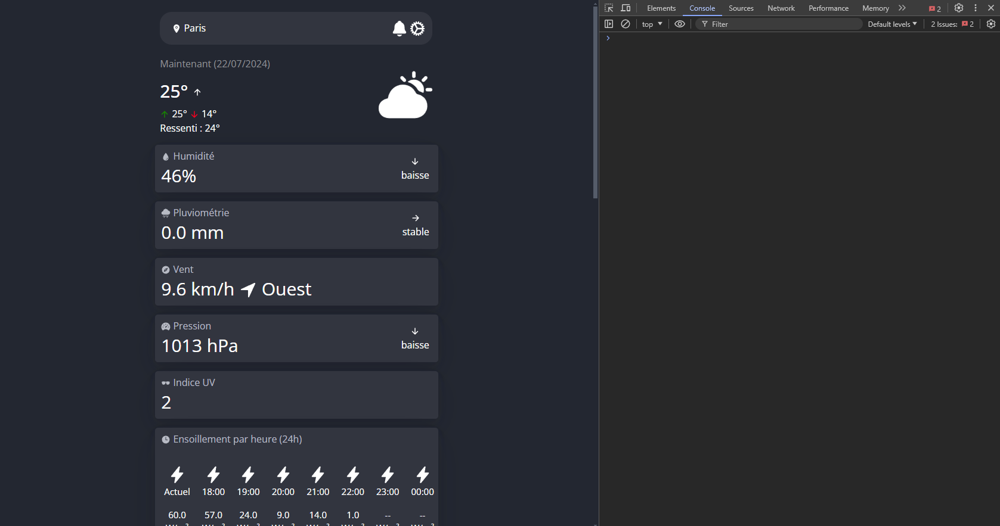
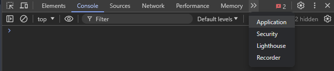

# Gestion des cookies

!!! warning "Avertissement"
    Ce tutoriel n'est pas compatible avec la version téléphone.

## Ouvrir le devtools
Pour commencer, rendez-vous sur la page d'accueil de votre instance Wezzer. Une fois ceci fait, effectuez le raccourci suivant : **Ctrl + Shift (Maj) + J**.

Vous devriez avoir une devtools qui s'ouvre à votre droite, comme sur la capture d'écran ci-dessous.

Cliquez ensuite sur la flèche **>>**, puis séléctionnez **Application**.

Recherchez l'option **Cookies**, puis cliquez sur le menu déroulant juste en dessous (localhost:8080 pour ma part, cela peut être différent pour vous).

