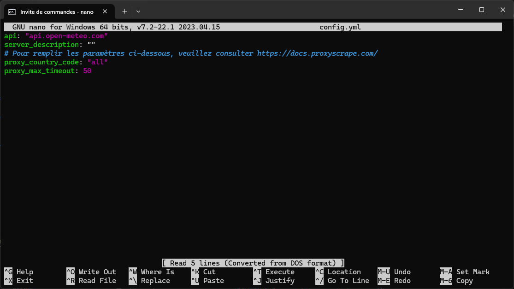

# :material-book: Guide de démarrage

## Installation et utilisation

### :simple-docker: Depuis Docker (recommandé)

!!! note
    Nous vous conseillons d'installer Wezzer en utilisant Docker. Cette méthode facilite l'installation et améliore la sécurité de votre serveur.

    En outre, elle permet un déploiement immédiat sans configuration préalable, et contribue également à une accélération du chargement des pages.

#### Récupérer l'image via Docker Hub (recommandé)

```
docker pull luckyluka17/wezzer
``` 

Puis créez un conteneur :
```
docker run -p 8080:8080 luckyluka17/wezzer
```

#### Créer sa propre image Docker
1. Cloner le dépôt
    ```
    git clone https://github.com/Luckyluka17/Wezzer
    cd Wezzer
    ```

2. Créer l'image Docker
    ```
    docker build -t wezzer .
    ``` 
3. Créer le conteneur
    ```
    docker run -p 8080:8080 wezzer
    ```

Votre instance est désormais en ligne, suis l'adresse [http://localhost:8080](http://localhost:8080).

!!! info
    Vous pouvez changer le port utilisé par l'application en changeant la commande comme ceci :
    ```
    docker run -p PORT:8080 luckyluka17/wezzer
    ```

    Exemple ; J'ai envie d'héberger mon application sur le port 5780 :
    ```
    docker run -p 5780:8080 luckyluka17/wezzer
    ```

!!! tip "Astuce"
    Si vous souhaitez que le conteneur redémarre avec votre système, vous pouvez utiliser la commande suivante :
    ```
    docker run -p 8080:8080 luckyluka17/wezzer --restart=always
    ```


### :simple-git: Depuis la source
1. Cloner le dépôt
    ```bash
    git clone https://github.com/Luckyluka17/Wezzer.git
    cd Wezzer
    ```

2. Mettre en place l'environnement virtuel Python
    ```bash
    python -m venv .venv
    ```

    ou

    ```bash
    python3 -m venv .venv
    ```

    :warning: **Pensez à activer l'environnement virtuel, en suivant les instructions ci dessous.**

    !!! note "Activer l'environnement Python"

        [Source (documentation officielle de Python)](https://docs.python.org/3/library/venv.html)

        | Plateforme | Terminal | Commande pour activer l'environnement virtuel |
        | --- | --- | --- |
        | Posix | bash | ```source .venv/bin/activate``` |
        | Posix | fish | ```source .venv/bin/activate.fish``` |
        | Posix | csh/tcsh | ```source .venv/bin/activate.csh``` |
        | Posix | PowerShell | ```.venv/bin/Activate.ps1``` |
        | Windows | cmd.exe | ```.venv\Scripts\activate.bat``` |
        | Windows | PowerShell | ```.venv\Scripts\Activate.ps1``` |

3. Installez les dépendances Python
    ```bash
    pip install -r requirements.txt
    ```

    ou

    ```bash
    pip3 install -r requirements.txt
    ```

4. Ajustez les paramètres de votre instance
    ```bash
    nano config.yml
    ```

5. Démarrer l'application
    ```
    waitress-serve --port=8080 --threads=8 --call main:init
    ```

## Gérer les paramètres de l'instance

### Accéder au fichier de configuration

Pour modifier les paramètres par défaut de votre instance, ouvrez un terminal situé dans le répertoire de Wezzer, puis entrez la commande suivante :

```sh
nano config.yml
```



!!! warning "Important"
    Si vous êtes sur Windows, veuillez installer [nano](https://community.chocolatey.org/packages/nano) via le gestionnaire de paquets [chocolatey](https://chocolatey.org/install).

### Liste des paramètres disponibles

| Nom du paramètre | Type de valeur | Valeur par défaut | Description |
| --- | --- | --- | --- |
| **api** | `string` (texte) | ```api.open-meteo.com``` | Permet de changer le domaine de l'API, afin d'utiliser une API alternative basée sur celle d'Open-Meteo. | 
| **server_description** | `string` (texte) | vide | Ajoutez une description à votre serveur visible par les utilisateurs |
| **proxy_country_code** | `string` (texte) | ```all``` | Définit la localisation du proxy. Veuillez consulter [cette page](https://docs.proxyscrape.com/) pour avoir plus de détails |
| **proxy_max_timeout** | `int` (nombre entier) | ```50``` | Définit la latence maximale du proxy ; par exemple, en spécifiant 50, Wezzer n'utilisera que des proxys avec une latence inférieure ou égale à 50 ms. |